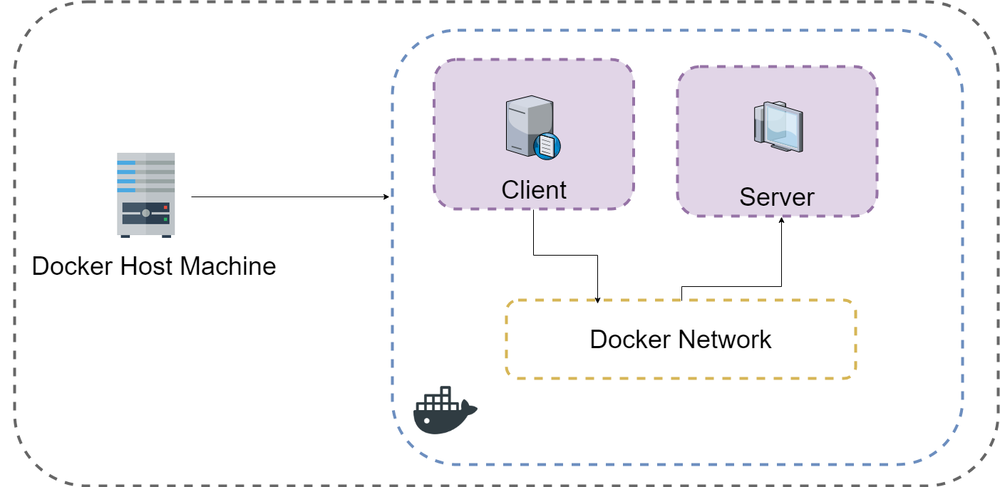
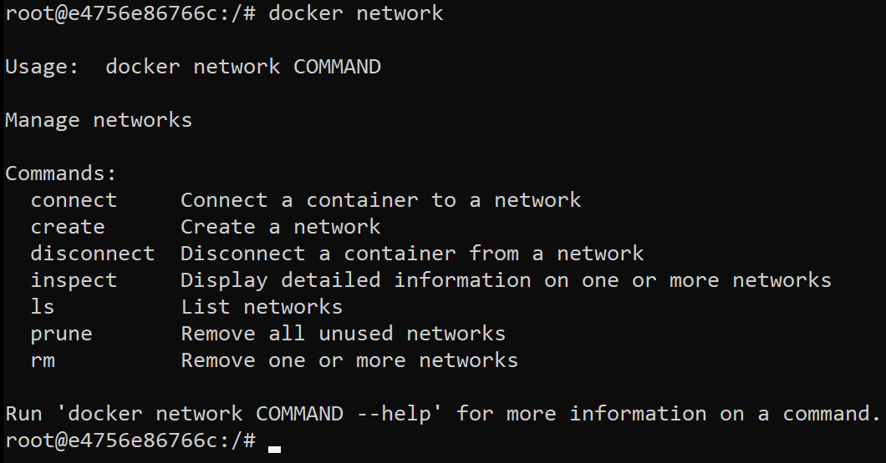

# Концепция сети в Docker

## Познакомимся с тем, как объединять несколько контейнеров в сеть Docker 

Сеть Docker в основном используется для установки связи между контейнерами Docker и внешним миром через хост-машину. Также можно сказать, что это коммуникационный канал, через который все изолированные контейнеры взаимодействуют друг с другом в различных ситуациях для выполнения необходимых действий. 

Перед тем как приступить к основной части материала, закрепим некоторые базовые принципы, термины и определения относительно работы сетей, чтобы избежать противоречий и ошибочного восприятия.

## Сети: вводная часть

### Что такое сеть? 

Локальная сеть (Local Area Network, LAN) – объединение компьютеров, сосредоточенных на небольшой территории. В общем случае локальная сеть представляет собой коммуникационную систему, принадлежащую одной организации: школа, университет, больница, банк и т.д. При построении сети используют следующие компоненты:

1. Оконечные узлы: устройства, которые передают и/или принимают какие-либо данные. Это могут быть смартфоны, компьютеры, телевизоры, сервера, различные терминалы приема оплаты. Например: метро, сотовая связь, услуги ЖКХ и и т.д.

2. Промежуточные устройства: это устройства, которые соединяют оконечные узлы между собой. Сюда можно отнести коммутаторы, концентраторы, модемы, маршрутизаторы, точки доступа Wi-Fi, базовые станции мобильных операторов. 

3. Сетевые среды: это те среды, в которых происходит непосредственная передача данных. Сюда относятся проводные кабели (например, Ethernet), сетевая карта вашего компьютера. Если это кабель, то передача данных осуществляется при помощи электрических сигналов. У оптоволоконных кабелей, при помощи световых импульсов, и радиоволны в случае использования беспроводной среды (WiFi, Bluetooth, LoRa и др.).

Следующее, что нам надо знать - это `порт` и `протокол`.

1. Порт - это цифра. Например 21, 22, 25, 80, 433, 8080. Это число записывается в заголовках протоколов транспортного уровня (об этом ниже). Порт указывает, для какой программы предназначен тот или иной пакет (информация, передаваемая одним приложением другому). Например, http-сервер работает через порт 80. Когда вы открываете браузер, вы отправляете запрос на веб-сервер через 80 порт, и сервер понимает что это http запрос и вам нужен сервер, который передаст вам страницу в формате html (ответ сервера).

2. Протокол. Например, TCP/IP - это адрес узла (компьютера) с указанием порта и передаваемых данных. Например, чтобы передать информацию по протоколу TCP/IP, нужно указать следующие данные:

```
Адрес отправителя (Source address):
IP: 82.146.49.11
Port: 2049

Адрес получателя (Destination address):
IP: 195.34.32.111
Port: 53
Данные пакета:
Send test message 
```
Благодаря этим данным информация будет передана на нужный узел. По такому приципу формируеся клиент-серверная передача данных.

Клиент — это модуль, предназначенный для формирования и передачи сообщений-запросов к ресурсам удаленного компьютера от разных приложений с последующим приемом результатов из сети и передачей их соответствующим приложениям.

Сервер — это модуль, который постоянно, ожидает прихода из сети запросов от клиентов и, приняв запрос, пытается его обслужить, как правило, с участием локальной ОС; один сервер может обслуживать запросы сразу нескольких клиентов (поочередно или одновременно). 



### Объяснение работы сетей в контейнарах Docker

> В зависимости от установленных версий Docker и операционной ситемы (ОС) на вашем компьютере, в редких случаях работа с сетью может отличаться. Рекомендуем использовать Docker последней стабильной версии, чтобы избежать возможных ошибок. Все команды, перечисленные в текущем документе, протестированы в ОС Linux дистрибутива Ubuntu с правами root (суперпользователь).

Для управления сетевыми операциями, такими как создание новой сети, подключение контейнера к сети, отключение контейнера от сети, перечисление доступных сетей, удаление сетей и т. д., мы используем следующую команду: `docker network`.



### Типы сетевых драйверов Docker

ЧтоЧтобы получить список всех ваших сетей, запустите: `docker network ls`. Кратко познакомимся с их описанием.

1. **Bridge network**: при запуске Docker автоматически создается сеть типа мост по умолчанию. Недавно запущенные контейнеры будут автоматически подключаться к нему. Вы также можете создавать пользовательские настраиваемые мостовые сети. Пользовательские мостовые сети превосходят сетевые мосты по умолчанию.

2. **Host network**: удаляет сетевую изоляцию между контейнером и хостом Docker и напрямую использует сеть хоста. Если вы запускаете контейнер, который привязывается к порту 80, и вы используете хост-сеть, приложение контейнера доступно через порт 80 по IP-адресу хоста. Это означает, что вы не сможете запускать несколько веб-контейнеров на одном хосте, на одном и том же порту, так как порт теперь является общим для всех контейнеров в сети хоста.

3. **None network**: в сети такого типа контейнеры не подключены ни к одной сети и не имеют доступа к внешней сети или другим контейнерам. Итак, эта сеть используется, когда вы хотите полностью отключить сетевой стек в контейнере.

4. **Overlay network**: Создает внутреннюю частную сеть, которая охватывает все узлы, участвующие в кластере swarm. Таким образом, оверлейные сети облегчают обмен данными между сервисом **Docker Swarm** и автономным контейнером или между двумя автономными контейнерами на разных демонах Docker.

5. **Macvlan network**: Некоторые приложения, особенно устаревшие приложения, отслеживающие сетевой трафик, ожидают прямого подключения к физической сети. В такой ситуации вы можете использовать сетевой драйвер *Macvlan* для назначения MAC-адреса виртуальному сетевому интерфейсу каждого контейнера, что делает его физическим сетевым интерфейсом, напрямую подключенным к физической сети.

## Познакомимся с сетями **Bridge** и **Host** на практике

1. Сеть типа **Bridge**
Будем использовать два контейнера с ОС Alpine для объяснения этого типа сети. Для удобства в качестве имен контейнеров будем использовать короткие названия. 
- Первый контейнер назовем: **C1**. 
- Второй контейнер назовем: **C2**.

Чтоб запустить наши тестовые Docker контейнеры с образом Alpine, используем следующие команды:

```bash
# docker run -it -d --name c1 alpine ash
# docker run -it -d --name c2 alpine ash
```

Далее давайте выясним IP-адреса этих запущенных контейнеров. Для этого выполним следующие команды:

```bash
# docker exec -it c1 sh –c “ip a”
# docker exec -it c2 sh –c “ip a”
```

Результаты выполнения первой и второй команды представлены на рисунках.


Рисунок 1 - Отображение IP-адреса первого контейнера с1


Рисунок 2 - Отображение IP-адреса первого контейнера с1

Как видите, IP-адрес контейнера C1 - **172.17.0.2**, а IP-адрес C2 – **172.17.0.3**.
Теперь продолжим наше знакомство с сетевыми утилитами и попытаемся проверить их связь друг с другом. Для этого будем использовать команду **ping**. Чтобы убедиться в том, что они могут обращаться друг к другу. Для начала подключимся к контейнеру **C1** командой `docker attach c1` и проверим связь с контейнером **C2**. Для этого выполним команды:

```bash
# docker attach c1
# Ping –c 2 172.17.0.3
```

Как вы можете видеть на скриншотах, показанных выше, происходит конекшен между контейнерами в одной сети. Мы также можем проверить это, проверив сеть типа мост с помощью команды: `docker network inspect bridge` 
Приведенная выше команда отобразит всю информацию о сети, такую как тип сети, подсеть, шлюз, имя контейнера и IP-адрес и т.д.

### Создание пользовательской Bridge сети

Как я уже говорил, при запуске Docker автоматически создается сеть bridge по умолчанию.
Все вновь запущенные контейнеры будут автоматически подключаться к ней.
Однако вы также можете создавать пользовательские мостовые сети.
Чтобы создать новый сетевой драйвер, просто запустите: `docker network create my_net` или `docker network create --driver bridge dhruv_net`.

Обе команды будут выполнять одинаковую работу.
Если вы не укажете имя драйвера, сеть будет создана в сетевом драйвере по умолчанию, т.е. bridge.

В пользовательских сетях, таких как dhruv_net, контейнеры могут не только связываться по IP-адресу, но также могут преобразовывать имя контейнера в IP-адрес.
Эта возможность называется автоматическим обнаружением службы.

Чтобы убедиться, что контейнеры могут взаимодействовать друг с другом, давайте запустим три alpine контейнера, а именно A1, A2 и A3 в сети dhruv_net, которую мы создали ранее.

```bash
docker run -it -d --name A1 --network dhruv_net alpine ash
docker run -it -d --name A2 --network dhruv_net alpine ash
docker run -it -d --name A3 --network dhruv_net alpine ash
```

Теперь попробуйте подключиться к любому из контейнеров и пропинговать два других, используя имя контейнера.

Из приведенных выше снимков экрана доказано, что контейнеры могут общаться друг с другом.

2. Хостовая Сеть
Мы запускаем контейнер, который привязывается к порту 80, используя хост-сеть, приложение контейнера доступно через порт 80 по IP-адресу хоста.

Сеть типа Host нужна только тогда, когда вы запускаете программы с очень специфической сетью.

Приложения, работающие внутри контейнера Docker, выглядят так, как будто они работают на самом хосте с точки зрения сети.
Это позволяет контейнеру получить больший доступ к сети, чем он может получить.

Здесь мы использовали команду `netstat -ntlp` для отображения порта прослушивания на сервере. Мы рассмотрели только основы сетевых концепций Docker.

Для более подробной информации предлагаем вам заглянуть в руководство по работе с сетями Docker, которое прилагается ниже.
https://docs.docker.com/v17.09/engine/userguide/networking/#exposing-and-publishing-ports
