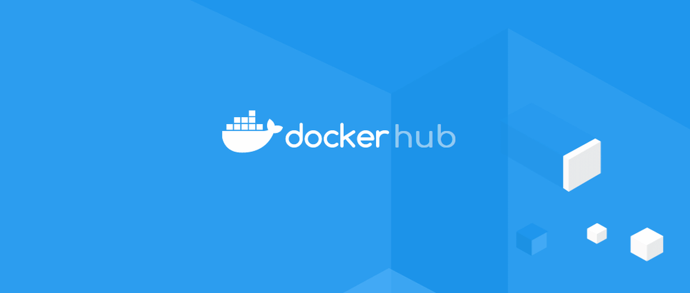
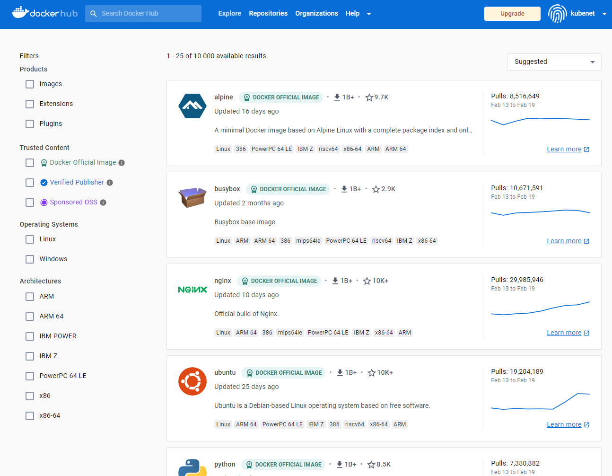
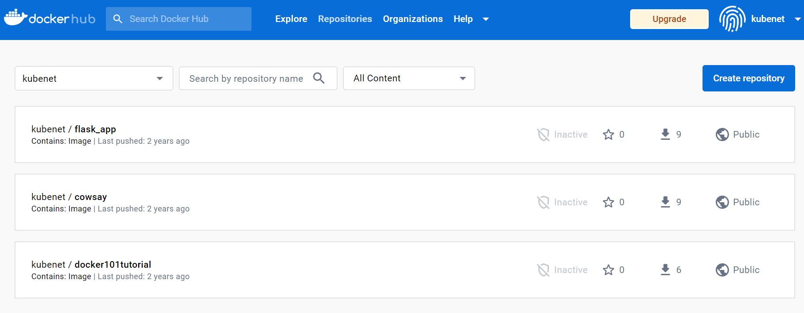
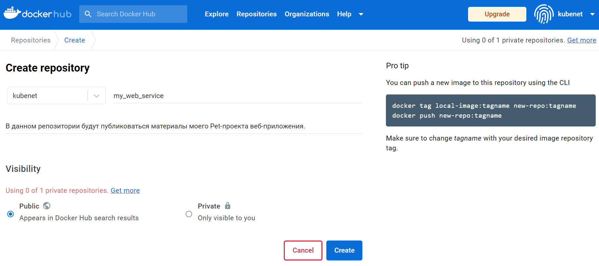
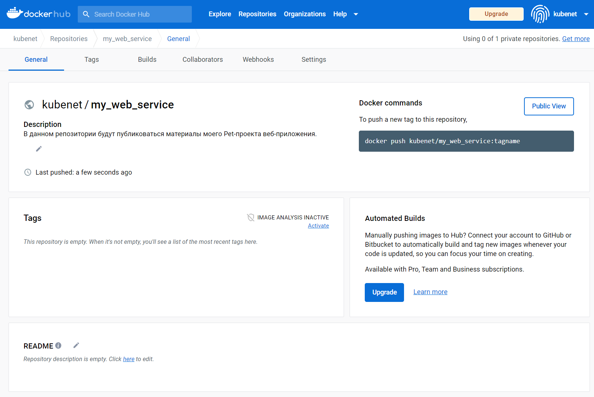
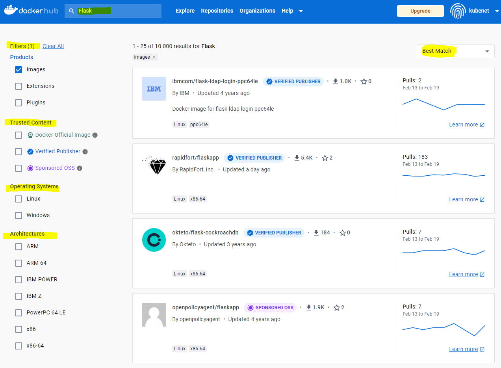
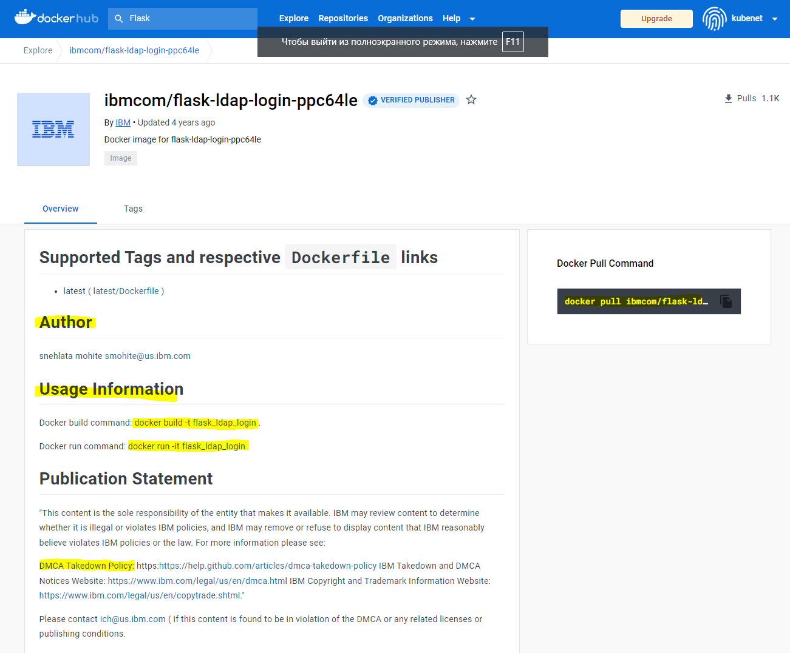

# Реестр Docker 

В предыдущем разделе мы уже кратко познакомились с технологией Docker. Что такое Docker контейнер, Docker образ, как связаны эти сущности и как мы можем их использовать. Теперь пришло время познакомиться с таким понятием как Docker Registry (реестр Docker). 


В этом разделе мы познакомимся с сервисом **"Docker Hub"**, узнаем о его возможностях, как использовать его для поиска Docker образов, созданных сторонними разработчиками, опубликовавшими свои проекты в виде образа. 
Рассмотрим все этапы работы с сервисом **"Docker Hub"**. Узнаем как скачать и загрузить образ в **"Docker Hub"**. Создадим там собственный репозиторий, который позволит делиться созданными нами Docker образами. 

> Вам требуется базовое понимание Docker, знакомое с окружением Windows и Linux. В этом руководстве будет использоваться инструмент Docker Desktop для выполнения текущих упражнений, т.е. для создания и передачи образа в Docker Hub. 

Хотя образы Docker легко создаются и разработчикам удобно работать с простыми и портативными образами Docker, быстро обнаружилось, что управлять тысячами образов Docker довольно трудно. Решить эту проблему позволяет реестр Docker. Реестр Docker — это стандартный способ хранения и распространения образов Docker. Реестр — это репозиторий с открытым исходным кодом, имеющий разрешительную лицензию Apache.

Реестр Docker также помогает улучшить управление правами доступа и безопасность образов Docker, хранящихся в его репозитории. Он управляет распространением образов, а также может интегрироваться с рабочими процессами разработки приложений. Разработчики могут настроить собственный реестр Docker или использовать размещенный сервис реестра Docker, например, Docker Hub, Oracle Container Registry, Azure Container Registry и т. д.


Docker Flow - процесс работы   

Docker Hub — это размещенный реестр Docker, управляемый Docker. Docker Hub содержит более 100 000 образов контейнеров от поставщиков программного обеспечения, а также проекты с открытым исходным кодом и сообщества. Docker Hub содержит программное обеспечение и приложения из официальных репозиториев, таких как NGINX, Apache, MySQL, Ubuntu, Python, Flask и т.д.

Он позволяет нам извлекать и добавлять Doсker образы в Docker Hub. 
Его также можно сравнить с GitHub, где мы получаем и отправляем наш исходный код, но в случае Docker Hub мы работаем с образами Docker контейнеров.

Облачный онлайн-репозиторий «Docker Hub» использует два типа репозиториев: 
- Общедоступный репозиторий;
- Частный репозиторий.

Общедоступные репозитории доступны всем пользователям сервиса Docker Hub, в то время как частный репозиторий доступен только его владельцу (аналогично как репозитории на GitHub). 

## Реестр Docker

Хотя образы Docker легко создаются и разработчикам удобно работать с простыми и портативными образами Docker, быстро обнаружилось, что управлять тысячами образов Docker довольно трудно. Решить эту проблему позволяет реестр Docker. Реестр Docker — это стандартный способ хранения и распространения образов Docker. Реестр — это репозиторий с открытым исходным кодом, имеющий разрешительную лицензию Apache.

Реестр Docker также помогает улучшить управление правами доступа и безопасность образов Docker, хранящихся в его репозитории. Он управляет распространением образов, а также может интегрироваться с рабочими процессами разработки приложений. Разработчики могут настроить собственный реестр Docker или использовать размещенный сервис реестра Docker, например, Docker Hub, Oracle Container Registry, Azure Container Registry и т. д.

При запуске контейнера Docker по умолчанию автоматически извлекает соответствующий образ из общедоступного Docker Hub, если он недоступен локально. Вы также можете создавать собственные образы и отправлять их в Docker Hub в общедоступный или частный репозиторий.



Рисунок 1. Снимок экрана реестра Docker

## Создание первого Docker репозитория

Первым делом требуется авторизоваться в Docker Hub, используя ваши учетные данные. Если у вас нет учетной записи, вы можете создать ее, нажав кнопку Register (Регистрация) на странице "https://hub.docker.com". После того, как вы авторизовались на сервисе, вы можете создать репозиторий, нажав на кнопку «Create repository» (Создать репозиторий). 



Рисунок 2. Создание Docker Hub репозитория

Откроется окно, в котором предлагается заполнить краткую информацию о новом репозитории. В качестве примера создадим открытый (публичный) репозиторий с названием "**my_web_service**". 

> Docker Hub предоставляет нам только один частный репозиторий бесплатно. Если нам нужно больше частных репозиториев, мы можем обновить нашу учетную запись до платного плана.



Рисунок 3. Параметры нового репозитория Docker Hub

Как только все будет сделано, нажмите Создать (Create). 
Поздравляем! Вы создали свой первый репозиторий, который будут выглядеть следующим образом.



Рисунок 4. Созданый репозиторий Docker Hub

Теперь откройте приложение Docker Desktop tool или консоль (terminal) Docker, и войдите в Docker Hub с помощью команды: `docker login`

## Поиск Docker образа

Для поиска образа на Docker Hub нам доустпны 2 способа:  
- Поиск на веб-сайте Docker Hub через браузер. Для этого надо перейти в раздел «Explore» в верхнем меню Docker Hub.
- Через командную строку (терминал). В таком случае, если мы хотим найти образ Flask, мы можем воспользоваться следующей командой: `docker search mysql`



Преиммуществом поиска Docker образа в веб-браузере является возможность поиск апо ключевым словам и выбор наиболее подходящего образа. Есть возможность ознакомиться с его описанием, документацией и содержимым, а также скопировать команду для загрузки найденного Docker образа на свой компьютер (Docker Pull Command).



## Загрузка Docker образа из реестра Docker Hub
Чтоб загрузить Docker образ из Docker Hub, нужно использовать команду **`pull`** следующим образом: **`docker pull <image_name>`**. Например, если требуется скачать последнюю стабильную версию Docker образа **MySQL**, можно использовать следующую команду:
**`docker pull mysql`**

Если образ mysql уже есть на нашем компьютере, то приведенная выше команда автоматически обновит образ до последней версии. Здесь нужно помнить одну вещь: если мы выполним поиск на Docker Hub, нам отобразится список различных образов MySQL. Нам нужно найти подходящий вариант в зависимости от решаемой задачи. Допустим, мы хотим получить образ bitnami/mysql.
`docker pull bitnami/mysql`

## Создание Docker образа

Этот процесс требует Dockerfile. Мы можем рассматривать Dockerfile как руководство по эксплуатации, которое говорит Docker, что собирать (подобие requirements.txt в venv для python). Проще говоря, это файл конфигурации, в котором хранится инструкция по сборке.

## Как это работает?

Docker читает инструкцию из Dockerfile и автоматически создает образы. Образ Docker является многоуровневой файловой системой и состоит из нескольких слоев, доступных только для чтения, и каждый слой образа Docker представляет инструкции файла Docker. Давайте выполним следующие шаги, чтобы создать образ с помощью Dockerfile.

## Создайте Dockerfile, который определяет конфигурацию нашего приложения

sudo vim Dockerfile
Примечание. Имя файла должно быть **`Dockerfile`** с большой латинской буквы D.
```
FROM ubuntu:16.04
MAINTAINER someuser@somedomain.com
RUN apt-get update
RUN apt-get install –y mysql
CMD echo "My first image created.
```

Давайте посмотрим на некоторые важные ключевые слова, используемые в **`Dockerfile`**

Мы можем использовать символы #, чтобы добавить комментарий в **`Dockerfile`**
Ключевое слово `FROM` определяет базовый образ, которое будет использоваться.
Ключевое слово `MAINTAINER` - это пользователь, который будет поддерживать этот образ.
Ключевое слово `RUN` используется для запуска инструкции, приведенной для образа. В нашем случае сначала обновите систему, а затем установите MySQL.
Ключевое слово `CMD` используется для выполнения команды после запуска контейнера.
Ключевое слово `COPY` можно использовать для копирования файла из нашей хост операционной системы в док-контейнер.
Ключевое слово `EXPOSE` используется для указания номера порта, на котором контейнер будет выполнять свой процесс.
Запустите команду ниже, чтобы создать наш образ Docker
Синтаксис
**`docker build -t /repo-name`**

**`docker build -t <user_name>/<repo_name> .`**
В приведенной выше команде имя изображения и символ точка « . » указывает текущий рабочий каталог. Это означает, что Docker ищет текущий каталог файла Docker. Опция `-t` используется для обозначения образа.

Вывод будет похож на:

`docker build`

Теперь давайте проверим наш образ, запустив его с помощью команды запуска docker.

`docker run asadali08527/first-repo`

Выполнение вышеупомянутой команды попросит ваш **`Dockerfile`** образ успешно установить MySQL на ваш компьютер со всеми необходимыми обновлениями, и, наконец, он также отобразит сообщение.

Заливаем образ на Docker Hub. Как только наш образ был успешно создан и запущен, мы можем отправить его в Docker Hub с помощью команды push.

`docker push asadali08527/first-repo`

Мы можем проверить теги образа и статус на Docker Hub, который будет выглядеть примерно так.

## Образ на Docker Hub

Что такое DOCKER CERTIFIED образы?
Это официальные образы поставщиков или участников. Образ может быть сертифицирован Docker Hub, только если его содержимое соответствует правилам, стандартам и законам, предусмотренным Docker Hub. Проще говоря, этот образ должен пройти определенные базовые тесты.

Docker Hub предоставляет инструмент inspectDockerImage, с помощью которого поставщик может самостоятельно сертифицировать образы и плагины (обычно поставщик или участник публикует свои плагины для регистрации томов и сетей).

>Примечание:
>Чтобы опубликовать наш образ в качестве сертифицированного Docker образ, сначала мы должны самостоятельно сертифицировать и протестировать наш образ и плагин с помощью инструмента inspectDockerImage, после того как мы сертифицировали и успешно протестировали, после отправки Docker Hub подтвердит его. Если наш контент требует несертифицированной среды, он не может быть опубликован как сертифицированный ни при каких обстоятельствах.

>**Рекомендации**
>- Ищите конкретную версию Docker образа, используя теги, в основном последние. Это необходимо, чтобы избежать возможных конфликтов и сбоев в случае несовместимости пакетов в вашем проекте и библиотек, модулей в составе Docker образа.
>- Выберите тот, который имеет максимальные загрузки и звезды.
>- Проверьте его обновления (когда он был обновлен последний раз).
>- Если возможно, проверьте его тип: проверенный издатель или официальный (Docker Certified).
